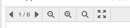
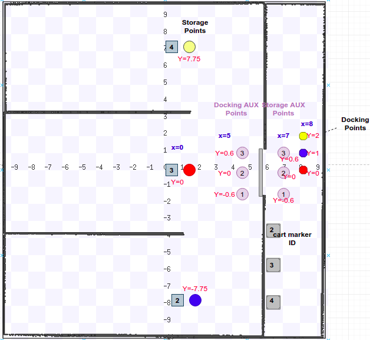

# Robotics-Events

**Prerequisites** The repository will be built using bnd version 5.1.2, so the Maven version must be at least 3.5.4


This repository defines the Events in the `eu.brain.iot.robot.api` sub-project to be used in the updated Service Robotics use case. It contains the following packages:

* **eu.brain.iot.robot.events**  (contains events between robot behaviour and ROS Edge Node)
* **eu.brain.iot.warehouse.events**   (contains events between robot behaviour and Warehouse Manager)

This repository also contains the door.api, door.impl, Robot Behaviour, single-framework-example projects updated based on the M18 version, to be used in updated use case later.

See [BRAIN-IoT Events Word file](https://istitutoboella-my.sharepoint.com/:w:/g/personal/pert-projects_ismb_it/EaXDJA-FWppKsPSoleB5INsBm7kAwY1yRTDb9p4A0NZdZQ?e=yTaiG6) the detailed explaination of events.

The latest Robot Behaviour Workflow, which is exported as a HTML file with multiple pages"

* **Page 1**: Robot Behaviour Workflow in simulation, without checking door status and PickCart event hsa cart marker ID property
* **Page 2**: Robot Behaviour Workflow in real robot, checking door status and all PickCart event are same, except the robotID

Note: to simplify the development of the robot behaviour, the `PickCart` event could be always contains the cart ID property in both Simulation and Real robot, ROS Edge Node will ignore this property when it's not needed.

* **Page 3**: Service Robotic Architecture with SensiNact
* **Page 4**: Sequence Diagram with simplified Pickup Mission Execution
* **Page 5**: Sequence Diagram with complete Pickup Mission Execution steps, involving SensiNact, Warehouse Backend, Robot Beahviour, Ros Edge Node, Door Edge Node
* **Page 6**: Copy of **Page 5**, but also appended with the `Go back to Docking Area` sequence Diagram
* **Page 7**: Copy of **Page 5**, but also involing the Physical Robot, and the detailed `Pickup Mission Execution` steps between ROS Edge Node and Physical Robot are also presented in  Physical Robot


To see the different pages, download the `Robotic_Workflows_SIM_and_RealRobot_Sequence_Diagrams.html` file and open it in browser, in the left-top of the fist page, there is the options to switch between different pages.



To edit the diagram, download the source file `Robotic_Workflows_SIM_and_RealRobot_Sequence_Diagrams_latest.drawio`, and open it in the Google APP `Diagrams.net Desktop `.


## Build
clone the repository
```bash
$ cd robotics-events
$ mvn clean package # or "mvn clean install"
```
Note: the `smart-behaviour-maven-plugin` has already been added in the pom.xml of robot behaviour project to package it as a smart behaviour, each build must have the `clean` phase to remove the `smart-behaviour` directory in target folder

If there is the errors generated by the **bnd-export-maven-plugin** when exporting the `RobotBehaviour-Door.bndrun` in the single-framework-example project in terminal, like:
```bash
[INFO] --- bnd-export-maven-plugin:5.1.2:export (default) @ eu.brain.iot.single-framework-example ---
[ERROR] Error   : Fail on changes set to true (--xchange,-x) and there are changes
[ERROR] Error   :    Existing runbundles   [com.fasterxml.jackson.core.jackson-annotations;version='[2.10.0,2.10.1)']
......]
[ERROR] Error   :    Calculated runbundles [com.fasterxml.jackson.core.jackson-annotations;version='[2.10.0,2.10.1)']
```
You need to copy all printed auto-calculated bundles in brackets into the `-runbundles` instruction in the `RobotBehaviour-Door.bndrun`. Then build the repository again.

For further errors, welcome to let me know


## Run
The `RobotBehaviour-Door.bndrun` in **eu.brain.iot.single-framework-example** project will run the Robot Behaviour and Door bundles together. The Door bundle will directely open the door in simulation.

#### Configuration

There is only one robot behaviour service generated, which is configured in **src/main/resources/OSGI-INF/configurator/configuration.json** file in single-framework-example project, shown as:

```json
{
    ":configurator:resource-version" : 1,
    ":configurator:symbolic-name" : "eu.brain.iot.service.robotic.eu.brain.iot.single-framework-example.config",
    ":configurator:version" : "0.0.2-SNAPSHOT",
    
    "eu.brain.iot.example.robot.Door": {
    	"host": "localhost", 
        "port": "8080",
        "id": "ExampleDoor",
        "path": "/door1/door_controller/command"},
    
    
    "eu.brain.iot.robot.behaviour.Behaviour~BehaviourA": {
           "name": "RB1",
           "id": 1
    }
}
```

#### Launch

```bash
$ cd eu.brain.iot.single-framework-example/target
$ java -jar RobotBehaviour-Door.jar
 Hello!  I am robotBehavior : 1  name = RB1
+++++++++ filter = (|(robotID=1)(robotID=-1))
{
  "data" : 0.0
}

DOOR REST Service Invoked Successfully..
```

## Run RosEdgeNode.jar
this jar packages the ros edge node, door behaviour and the robot behaviour implemented by LINKS based on the old events defined by UGA. this jar will control one robot in the simulation to move all three carts, and the corresponding coordinates are hard-coded. the Door behaviour is the one for M18, it will directly open the simulated door.

Start the ROS simulation (be careful about the `$HOME`):
```bash
$ roslaunch rb1_brainiot_bringup brainiot_stage.launch world:=$HOME/catkin_ws/src/rb1_brainiot_bringup/worlds/door_map-rb1-base.world

$ roslaunch rb1_brainiot_bringup rb1_base_stage_complete.launch launch_stage:=false launch_rviz:=false
```

Then:

```bash
$ java -jar RosEdgeNode.jar
```

## Shared tables
The four tables in wiki managed by warehouse backend has been updated using the coordinates in simulation, it's waiting for the confirmation from **Robotnik**. Generally the layout of the points is shown in Stage GUI:




*Welcome to review and give comments*

